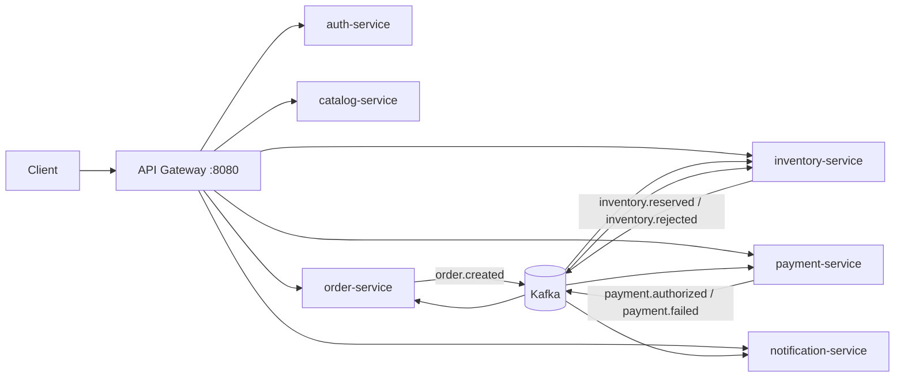

# Distributed E-Commerce Backend

This is a Java 17 and Spring Boot 3 e-commerce backend. It covers the main shopping workflow from authentication and product browsing to cart checkout, inventory reservation, payment processing, and asynchronous notifications.

The project is built as a distributed backend behind an API Gateway. Each business service has a clear responsibility and owns its own database in Docker mode. Services communicate through Kafka events instead of directly sharing tables, which keeps the boundaries clear and makes the system easier to scale.



## Core Workflow

The core user journey works like a real online shopping flow:

1. A user registers or logs in and receives a JWT.
2. The user browses products and can request a dynamic pricing quote.
3. The user adds products to the shopping cart.
4. The user checks out from the cart through the order API.
5. The order service saves the order, clears the cart, and publishes an `order.created` event.
6. The inventory service reserves stock.
7. The payment service authorizes or rejects payment.
8. The order service updates the final order status.
9. The notification service creates user-facing notifications asynchronously.

The main highlight is that checkout is not a simple CRUD operation. It starts an event-driven Saga across order, inventory, payment, and notification services.

## Technical Highlights

| Area | Implementation |
| --- | --- |
| RESTful API | Authentication, product, quote, cart, checkout, order, inventory, payment, and notification APIs |
| Business workflow | Shopping cart, dynamic pricing quote, and checkout Saga workflow |
| Local transactions | Spring `@Transactional` protects cart checkout, order creation, inventory reservation, payment authorization, and notification writes |
| Distributed transactions | Kafka-based Saga handles cross-service consistency and compensation |
| Security | Spring Security, JWT authentication, token validation, and role-based access control |
| Kafka | Domain events such as `order.created`, `inventory.reserved`, `payment.authorized`, and `payment.failed` |
| Reliability | Transactional outbox saves events in the same local transaction as business data before publishing to Kafka |
| Scalability | API Gateway, stateless services, Kafka consumer groups, Docker Compose scaling, and Kubernetes HPA example |

## Modules

| Module | Port | Responsibility |
| --- | --- | --- |
| `api-gateway` | 8080 | Single entry point, request routing, JWT validation |
| `auth-service` | 8081 | User registration, login, JWT issuing |
| `catalog-service` | 8082 | Product APIs and dynamic price quote |
| `order-service` | 8083 | Shopping cart, checkout, order query, Saga state update |
| `inventory-service` | 8084 | Stock query, restock, inventory reservation, compensation |
| `payment-service` | 8085 | Mock payment authorization and payment query |
| `notification-service` | 8086 | Asynchronous payment result notifications |
| `common` | - | Shared Kafka event models |

## API Overview

All APIs are accessed through the API Gateway:

```text
http://localhost:8080
```

| Feature | Method & Path | Auth | Description |
| --- | --- | --- | --- |
| Register | `POST /api/auth/register` | Public | Create a customer account |
| Login | `POST /api/auth/login` | Public | Return a JWT access token |
| List products | `GET /api/products` | Authenticated | View active products |
| Product detail | `GET /api/products/{id}` | Authenticated | View one product |
| Create product | `POST /api/products` | `ADMIN` | Add a product |
| Dynamic quote | `POST /api/products/{id}/quote` | Authenticated | Calculate volume and customer-tier discount |
| View cart | `GET /api/cart` | `CUSTOMER` | Query current user's shopping cart |
| Add cart item | `POST /api/cart/items` | `CUSTOMER` | Add a product to the shopping cart |
| Update cart item | `PUT /api/cart/items/{productId}` | `CUSTOMER` | Change product quantity in the cart |
| Remove cart item | `DELETE /api/cart/items/{productId}` | `CUSTOMER` | Remove one product from the cart |
| Clear cart | `DELETE /api/cart` | `CUSTOMER` | Empty the shopping cart |
| Direct checkout | `POST /api/orders/checkout` | `CUSTOMER` | Create an order from request items and start the Saga |
| Cart checkout | `POST /api/orders/checkout-from-cart` | `CUSTOMER` | Create an order from the cart, clear the cart, and start the Saga |
| My orders | `GET /api/orders/my` | `CUSTOMER` | Query current user's orders |
| Order detail | `GET /api/orders/{id}` | Owner or `ADMIN` | Query one order |
| Inventory list | `GET /api/inventory` | Authenticated | View inventory |
| Inventory detail | `GET /api/inventory/{productId}` | Authenticated | View stock for one product |
| Restock | `POST /api/inventory/restock` | `ADMIN` | Increase inventory |
| Payment detail | `GET /api/payments/{orderId}` | Owner or `ADMIN` | Query payment status |
| My notifications | `GET /api/notifications/my` | `CUSTOMER` | Query current user's notifications |
| Mark notification read | `POST /api/notifications/{id}/read` | Owner | Mark notification as read |

## Checkout and Saga Flow

Successful payment:

```text
POST /api/orders/checkout-from-cart
        |
        v
order-service reads cart, saves order, clears cart, and saves outbox event
        |
        v
Kafka: order.created
        |
        v
inventory-service reserves stock
        |
        v
Kafka: inventory.reserved
        |
        v
payment-service authorizes payment
        |
        v
Kafka: payment.authorized
        |
        v
order-service marks order as PAID
notification-service creates success notification
```

Failed payment:

```text
order.created -> inventory.reserved -> payment.failed
        |
        v
order-service marks order as CANCELLED
inventory-service releases reserved stock
notification-service creates failure notification
```

Use `paymentMode: "MOCK_OK"` to simulate success and `paymentMode: "MOCK_FAIL"` to simulate failure.

## Transaction Design

Local transaction examples:

| Service | Method | Purpose |
| --- | --- | --- |
| `order-service` | `CartService.checkoutFromCart` | Read cart, create order, clear cart, and reuse order checkout in one transaction |
| `order-service` | `OrderService.checkout` | Save order and outbox event atomically |
| `inventory-service` | `InventoryService.reserveForOrder` | Lock inventory, validate stock, save reservation, save outbox event |
| `payment-service` | `PaymentService.authorize` | Save payment result and outbox event |
| `notification-service` | `NotificationService.createOrderPaidNotification` | Store user notification |

Distributed transaction design:

- The project does not use 2PC.
- It uses a Kafka-based Saga.
- Each service commits its own local transaction.
- Services publish domain events through the transactional outbox pattern.
- Failure is handled by compensation, such as cancelling the order and releasing reserved inventory.

The transactional outbox pattern is used by order, inventory, and payment services. Instead of publishing Kafka messages directly from business logic, each service first saves an outbox record in the same local transaction as the business data. A scheduled publisher later sends pending outbox records to Kafka. This reduces the risk of saving data successfully but losing the related event.

## Security Design

- `auth-service` stores users and hashes passwords with BCrypt.
- Login returns a JWT.
- `api-gateway` validates JWTs before routing protected requests.
- Business services also validate JWTs.
- Role-based access control protects admin operations such as product creation and inventory restock.

Seed accounts:

| Username | Password | Roles |
| --- | --- | --- |
| `alice` | `password123` | `CUSTOMER` |
| `admin` | `admin123` | `ADMIN`, `CUSTOMER` |

## Kafka Topics

| Topic | Publisher | Consumer |
| --- | --- | --- |
| `order.created` | order-service | inventory-service |
| `inventory.reserved` | inventory-service | order-service, payment-service |
| `inventory.rejected` | inventory-service | order-service |
| `payment.authorized` | payment-service | order-service, notification-service |
| `payment.failed` | payment-service | order-service, inventory-service, notification-service |

## Run

Start all services:

```bash
docker compose up --build
```

Scale selected services:

```bash
docker compose up --build --scale order-service=2 --scale inventory-service=2 --scale payment-service=2 --scale notification-service=2
```

In Docker mode, each service uses PostgreSQL. When services are run directly from an IDE, they default to H2 in-memory databases.

## Quick Demo

Login:

```bash
curl -s -X POST http://localhost:8080/api/auth/login \
  -H 'Content-Type: application/json' \
  -d '{"username":"alice","password":"password123"}'
```

Save the returned token:

```bash
export TOKEN='paste-access-token-here'
```

Dynamic quote:

```bash
curl -X POST http://localhost:8080/api/products/1/quote \
  -H "Authorization: Bearer $TOKEN" \
  -H 'Content-Type: application/json' \
  -d '{"quantity":5,"customerTier":"VIP"}'
```

Add products to cart:

```bash
curl -X POST http://localhost:8080/api/cart/items \
  -H "Authorization: Bearer $TOKEN" \
  -H 'Content-Type: application/json' \
  -d '{"productId":1,"quantity":2,"unitPrice":399.00}'

curl -X POST http://localhost:8080/api/cart/items \
  -H "Authorization: Bearer $TOKEN" \
  -H 'Content-Type: application/json' \
  -d '{"productId":2,"quantity":1,"unitPrice":899.00}'
```

View cart:

```bash
curl http://localhost:8080/api/cart \
  -H "Authorization: Bearer $TOKEN"
```

Checkout from cart:

```bash
curl -X POST http://localhost:8080/api/orders/checkout-from-cart \
  -H "Authorization: Bearer $TOKEN" \
  -H 'Content-Type: application/json' \
  -d '{"paymentMode":"MOCK_OK"}'
```

Direct checkout is also available for testing without using the cart:

```bash
curl -X POST http://localhost:8080/api/orders/checkout \
  -H "Authorization: Bearer $TOKEN" \
  -H 'Content-Type: application/json' \
  -d '{
    "paymentMode":"MOCK_OK",
    "items":[
      {"productId":1,"quantity":2,"unitPrice":399.00}
    ]
  }'
```

Failed checkout with compensation:

```bash
curl -X POST http://localhost:8080/api/orders/checkout \
  -H "Authorization: Bearer $TOKEN" \
  -H 'Content-Type: application/json' \
  -d '{
    "paymentMode":"MOCK_FAIL",
    "items":[
      {"productId":2,"quantity":1,"unitPrice":899.00}
    ]
  }'
```

Query orders and notifications:

```bash
curl http://localhost:8080/api/orders/my -H "Authorization: Bearer $TOKEN"
curl http://localhost:8080/api/notifications/my -H "Authorization: Bearer $TOKEN"
```

## Project Strengths

- The project is not only CRUD. Cart checkout is a real business workflow that creates an order and triggers inventory, payment, and notification processing.
- Local transactions keep each service's own data consistent.
- Kafka events decouple services and allow asynchronous processing.
- The Saga pattern handles distributed transaction consistency without two-phase commit.
- The transactional outbox pattern improves event publishing reliability.
- Spring Security and JWT protect APIs with role-based access control.
- Stateless services, Kafka consumer groups, and deployment examples support horizontal scaling.
