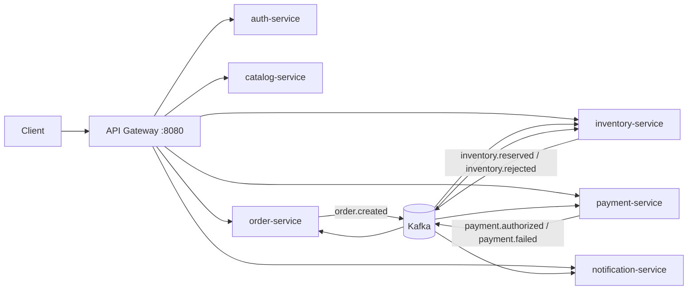

# Distributed E-Commerce Backend

This project is a Spring Boot 3 e-commerce backend built with Java 17. It demonstrates a complete order workflow with RESTful APIs, JWT security, Kafka-based asynchronous messaging, local transactions, and a Saga-style distributed transaction flow.

The system is implemented as multiple Spring Boot services behind an API Gateway. Each business service owns its own database in Docker mode, and services communicate through Kafka events instead of direct table sharing.



## Presentation Summary

The project simulates the core backend workflow of an online shopping platform:

1. A user registers or logs in and receives a JWT.
2. The user browses products and can request a dynamic pricing quote.
3. The user checks out through the order API.
4. The order service saves the order and publishes an `order.created` event.
5. The inventory service reserves stock.
6. The payment service authorizes or rejects payment.
7. The order service updates the final order status.
8. The notification service creates user-facing notifications asynchronously.

The main highlight is that checkout is not a simple CRUD operation. It starts an event-driven Saga across order, inventory, payment, and notification services.

## Requirement Mapping

| Requirement | Implementation |
| --- | --- |
| RESTful API | APIs for authentication, products, quote, checkout, orders, inventory, payment, and notifications |
| More than CRUD | Dynamic pricing quote and checkout Saga workflow |
| Local transaction | `@Transactional` in service methods such as checkout, inventory reservation, payment authorization, and notification creation |
| Distributed transaction | Kafka-based Saga with compensation when inventory or payment fails |
| Spring Security | JWT login, token validation, role-based access control, protected APIs |
| Kafka | Event publishing and consuming with topics such as `order.created`, `inventory.reserved`, and `payment.authorized` |
| Scalability | API Gateway, stateless services, Kafka consumer groups, Docker Compose scale command, and Kubernetes HPA example |

## Modules

| Module | Port | Responsibility |
| --- | --- | --- |
| `api-gateway` | 8080 | Single entry point, request routing, JWT validation |
| `auth-service` | 8081 | User registration, login, JWT issuing |
| `catalog-service` | 8082 | Product APIs and dynamic price quote |
| `order-service` | 8083 | Checkout, order query, Saga state update |
| `inventory-service` | 8084 | Stock query, restock, inventory reservation, compensation |
| `payment-service` | 8085 | Mock payment authorization and payment query |
| `notification-service` | 8086 | Asynchronous payment result notifications |
| `common` | - | Shared Kafka event models |

## API Feature List

All APIs are accessed through the API Gateway:

```text
http://localhost:8080
```

| Feature | Method & Path | Auth | Description |
| --- | --- | --- | --- |
| Register | `POST /api/auth/register` | Public | Create a customer account |
| Login | `POST /api/auth/login` | Public | Return a JWT access token |
| List products | `GET /api/products` | Public through service / protected through gateway | View active products |
| Product detail | `GET /api/products/{id}` | Public through service / protected through gateway | View one product |
| Create product | `POST /api/products` | `ADMIN` | Add a product |
| Dynamic quote | `POST /api/products/{id}/quote` | Public through service / protected through gateway | Calculate volume and customer-tier discount |
| Checkout | `POST /api/orders/checkout` | `CUSTOMER` | Create an order and start the Saga |
| My orders | `GET /api/orders/my` | `CUSTOMER` | Query current user's orders |
| Order detail | `GET /api/orders/{id}` | Owner or `ADMIN` | Query one order |
| Inventory list | `GET /api/inventory` | Authenticated | View inventory |
| Inventory detail | `GET /api/inventory/{productId}` | Authenticated | View stock for one product |
| Restock | `POST /api/inventory/restock` | `ADMIN` | Increase inventory |
| Payment detail | `GET /api/payments/{orderId}` | Owner or `ADMIN` | Query payment status |
| My notifications | `GET /api/notifications/my` | `CUSTOMER` | Query current user's notifications |
| Mark notification read | `POST /api/notifications/{id}/read` | Owner | Mark notification as read |

## Checkout Flow

Successful payment:

```text
POST /api/orders/checkout
        |
        v
order-service saves order and outbox event
        |
        v
Kafka: order.created
        |
        v
inventory-service reserves stock
        |
        v
Kafka: inventory.reserved
        |
        v
payment-service authorizes payment
        |
        v
Kafka: payment.authorized
        |
        v
order-service marks order as PAID
notification-service creates success notification
```

Failed payment:

```text
order.created -> inventory.reserved -> payment.failed
        |
        v
order-service marks order as CANCELLED
inventory-service releases reserved stock
notification-service creates failure notification
```

Use `paymentMode: "MOCK_OK"` to simulate success and `paymentMode: "MOCK_FAIL"` to simulate failure.

## Transaction Design

Local transaction examples:

| Service | Method | Purpose |
| --- | --- | --- |
| `order-service` | `OrderService.checkout` | Save order and outbox event atomically |
| `inventory-service` | `InventoryService.reserveForOrder` | Lock inventory, validate stock, save reservation, save outbox event |
| `payment-service` | `PaymentService.authorize` | Save payment result and outbox event |
| `notification-service` | `NotificationService.createOrderPaidNotification` | Store user notification |

Distributed transaction design:

- The project does not use 2PC.
- It uses a Kafka-based Saga.
- Each service commits its own local transaction.
- Services publish domain events through the transactional outbox pattern.
- Failure is handled by compensation, such as cancelling the order and releasing reserved inventory.

## Security Design

- `auth-service` stores users and hashes passwords with BCrypt.
- Login returns a JWT.
- `api-gateway` validates JWTs before routing protected requests.
- Business services also validate JWTs.
- Role-based access control protects admin operations such as product creation and inventory restock.

Seed accounts:

| Username | Password | Roles |
| --- | --- | --- |
| `alice` | `password123` | `CUSTOMER` |
| `admin` | `admin123` | `ADMIN`, `CUSTOMER` |

## Kafka Topics

| Topic | Publisher | Consumer |
| --- | --- | --- |
| `order.created` | order-service | inventory-service |
| `inventory.reserved` | inventory-service | order-service, payment-service |
| `inventory.rejected` | inventory-service | order-service |
| `payment.authorized` | payment-service | order-service, notification-service |
| `payment.failed` | payment-service | order-service, inventory-service, notification-service |

## Run

Start all services:

```bash
docker compose up --build
```

Scale selected services:

```bash
docker compose up --build --scale order-service=2 --scale inventory-service=2 --scale payment-service=2 --scale notification-service=2
```

In Docker mode, each service uses PostgreSQL. When services are run directly from an IDE, they default to H2 in-memory databases.

## Demo Requests

Login:

```bash
curl -s -X POST http://localhost:8080/api/auth/login \
  -H 'Content-Type: application/json' \
  -d '{"username":"alice","password":"password123"}'
```

Save the returned token:

```bash
export TOKEN='paste-access-token-here'
```

Dynamic quote:

```bash
curl -X POST http://localhost:8080/api/products/1/quote \
  -H "Authorization: Bearer $TOKEN" \
  -H 'Content-Type: application/json' \
  -d '{"quantity":5,"customerTier":"VIP"}'
```

Successful checkout:

```bash
curl -X POST http://localhost:8080/api/orders/checkout \
  -H "Authorization: Bearer $TOKEN" \
  -H 'Content-Type: application/json' \
  -d '{
    "paymentMode":"MOCK_OK",
    "items":[
      {"productId":1,"quantity":2,"unitPrice":399.00}
    ]
  }'
```

Failed checkout with compensation:

```bash
curl -X POST http://localhost:8080/api/orders/checkout \
  -H "Authorization: Bearer $TOKEN" \
  -H 'Content-Type: application/json' \
  -d '{
    "paymentMode":"MOCK_FAIL",
    "items":[
      {"productId":2,"quantity":1,"unitPrice":899.00}
    ]
  }'
```

Query orders and notifications:

```bash
curl http://localhost:8080/api/orders/my -H "Authorization: Bearer $TOKEN"
curl http://localhost:8080/api/notifications/my -H "Authorization: Bearer $TOKEN"
```

## Presentation Notes

When presenting this project, emphasize these points:

1. The project is not only CRUD. Checkout is a business workflow.
2. Local transactions keep each service's own data consistent.
3. Kafka events connect services asynchronously.
4. The Saga pattern handles distributed transaction consistency without 2PC.
5. The transactional outbox pattern makes event publishing more reliable.
6. Spring Security and JWT protect APIs.
7. Services are stateless and can be scaled horizontally.
