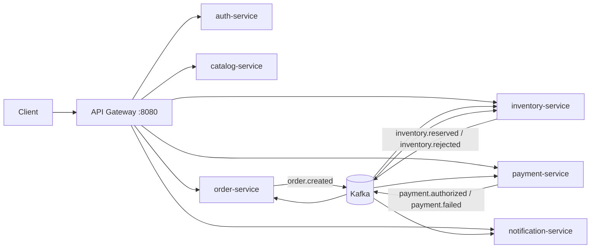

# Distributed E-Commerce Platform

A distributed e-commerce backend built with Spring Boot microservices. The platform provides product catalog, inventory reservation, checkout, payment processing, user notifications, JWT-based security, Kafka-driven asynchronous messaging, Saga-based distributed transactions, and transactional outbox publishing for reliable event delivery.



## Key Capabilities

| Capability | Implementation |
| --- | --- |
| RESTful API | Registration, login, products, pricing quote, checkout, order lookup, inventory lookup, payment lookup, notifications |
| More than CRUD | `POST /api/products/{id}/quote` calculates dynamic pricing; `POST /api/orders/checkout` starts a Saga workflow |
| Local transactions | `order-service` persists orders, `inventory-service` reserves stock, and `payment-service` records payments with `@Transactional` |
| Distributed transactions | Kafka-based Saga: create order -> reserve inventory -> authorize payment; failures cancel orders and release inventory |
| Transactional Outbox | Order, inventory, and payment services save outbox records in the same local transaction before asynchronous Kafka publishing |
| Spring Security | `auth-service` issues JWTs; the gateway and business services validate JWTs; `ADMIN` can add products and restock inventory |
| Kafka | Topics: `order.created`, `inventory.reserved`, `inventory.rejected`, `payment.authorized`, `payment.failed` |
| Notifications | `notification-service` consumes payment result events and stores user-facing notifications |
| Scaling | Docker Compose can scale service replicas; Kafka consumer groups and separate PostgreSQL databases support multiple instances |

## Modules

| Module | Port | Purpose |
| --- | --- | --- |
| `api-gateway` | 8080 | Single entry point, JWT validation, request routing |
| `auth-service` | 8081 | User registration, login, and JWT issuing |
| `catalog-service` | 8082 | Products and dynamic pricing quotes |
| `order-service` | 8083 | Checkout, order state, Saga state updates |
| `inventory-service` | 8084 | Stock reservation and compensation |
| `payment-service` | 8085 | Mock payment success and failure |
| `notification-service` | 8086 | Asynchronous user notifications |
| `common` | - | Shared Kafka event models |

## Package Structure

Each microservice follows a layered package structure:

```text
controller   REST API entry points
service      business logic and transaction boundaries
repository   Spring Data JPA repositories
entity       JPA entities and domain enums
dto          request and response objects
config       Spring configuration and seed data
exception    global exception handlers
kafka        Kafka consumers and topic-related integration
outbox       transactional outbox records and publishers
```

This structure keeps API, business logic, persistence, integration, and error-handling responsibilities explicit. Each microservice is already a small business boundary, so a layered package structure keeps the codebase easy to navigate without mixing transport, domain, and persistence concerns.

## Run

Docker is required. From the project root:

```bash
docker compose up --build
```

The API is available through the gateway:

```text
http://localhost:8080
```

To run multiple service replicas:

```bash
docker compose up --build --scale order-service=2 --scale inventory-service=2 --scale payment-service=2 --scale notification-service=2
```

In Docker mode, each service uses its own PostgreSQL database. When services are run directly from an IDE, they default to H2 in-memory databases.

## Seed Accounts

| Username | Password | Roles |
| --- | --- | --- |
| `alice` | `password123` | `CUSTOMER` |
| `admin` | `admin123` | `ADMIN`, `CUSTOMER` |

These accounts are inserted as seed data when `auth-service` starts. You can also register a new customer account.

## API Walkthrough

Register a new customer:

```bash
curl -s -X POST http://localhost:8080/api/auth/register \
  -H 'Content-Type: application/json' \
  -d '{"username":"bob","password":"password123"}'
```

Login:

```bash
curl -s -X POST http://localhost:8080/api/auth/login \
  -H 'Content-Type: application/json' \
  -d '{"username":"alice","password":"password123"}'
```

Copy the returned `accessToken`:

```bash
export TOKEN='paste-access-token-here'
```

List products:

```bash
curl http://localhost:8080/api/products \
  -H "Authorization: Bearer $TOKEN"
```

Get a dynamic pricing quote:

```bash
curl -X POST http://localhost:8080/api/products/1/quote \
  -H "Authorization: Bearer $TOKEN" \
  -H 'Content-Type: application/json' \
  -d '{"quantity":5,"customerTier":"VIP"}'
```

Create a successful order:

```bash
curl -X POST http://localhost:8080/api/orders/checkout \
  -H "Authorization: Bearer $TOKEN" \
  -H 'Content-Type: application/json' \
  -d '{
    "paymentMode":"MOCK_OK",
    "items":[
      {"productId":1,"quantity":2,"unitPrice":399.00}
    ]
  }'
```

Create a failed payment and compensation flow:

```bash
curl -X POST http://localhost:8080/api/orders/checkout \
  -H "Authorization: Bearer $TOKEN" \
  -H 'Content-Type: application/json' \
  -d '{
    "paymentMode":"MOCK_FAIL",
    "items":[
      {"productId":2,"quantity":1,"unitPrice":899.00}
    ]
  }'
```

Query current user's orders:

```bash
curl http://localhost:8080/api/orders/my \
  -H "Authorization: Bearer $TOKEN"
```

Query current user's notifications:

```bash
curl http://localhost:8080/api/notifications/my \
  -H "Authorization: Bearer $TOKEN"
```

`MOCK_OK` changes the order from `PENDING` to `INVENTORY_RESERVED` and then to `PAID`. `MOCK_FAIL` emits `payment.failed`, changes the order to `CANCELLED`, causes `inventory-service` to release the reserved stock, and creates a notification.

## Architecture Highlights

1. `order-service` checkout is not simple CRUD. It creates an order and publishes a domain event.
2. `inventory-service` locks inventory rows, checks stock, and writes reservation records inside a local transaction.
3. `payment-service` uses `paymentMode` to simulate a third-party payment gateway success or failure.
4. The Transactional Outbox pattern avoids losing Kafka events after a database commit.
5. The Saga avoids 2PC and uses events plus compensation for eventual consistency.
6. `notification-service` shows asynchronous event consumption outside the core transaction flow.
7. When a service is scaled to multiple replicas, all replicas share the same Kafka consumer group, so each order event is handled by only one replica of that service.

## Design Notes

The implementation uses PostgreSQL because it works well with Docker Compose, JPA, and row-level locking for inventory reservation. OpenFeign and Redis are intentionally not included because the core flow is event-driven and does not require synchronous service-to-service calls or caching. The auth service owns its user database, so seed users are persisted as normal service-owned data instead of being hard-coded in memory.
